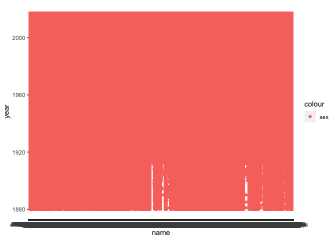

Homework\_3
================

I was having troubles knitting the file and commit it to github. Also, babynames data is very large it takes my laptop long time to generate the plot, knit, and commit.

``` r
library(babynames)
library(tidyverse)
```

    ## ── Attaching packages ─────────────────────────────────────── tidyverse 1.3.1 ──

    ## ✓ ggplot2 3.3.5     ✓ purrr   0.3.4
    ## ✓ tibble  3.1.4     ✓ dplyr   1.0.7
    ## ✓ tidyr   1.1.3     ✓ stringr 1.4.0
    ## ✓ readr   2.0.1     ✓ forcats 0.5.1

    ## ── Conflicts ────────────────────────────────────────── tidyverse_conflicts() ──
    ## x dplyr::filter() masks stats::filter()
    ## x dplyr::lag()    masks stats::lag()

``` r
head(babynames)
```

    ## # A tibble: 6 × 5
    ##    year sex   name          n   prop
    ##   <dbl> <chr> <chr>     <int>  <dbl>
    ## 1  1880 F     Mary       7065 0.0724
    ## 2  1880 F     Anna       2604 0.0267
    ## 3  1880 F     Emma       2003 0.0205
    ## 4  1880 F     Elizabeth  1939 0.0199
    ## 5  1880 F     Minnie     1746 0.0179
    ## 6  1880 F     Margaret   1578 0.0162

``` r
ggplot(data = babynames) +
  geom_point(mapping = aes(x = name, y = year, color = "class"))
```


