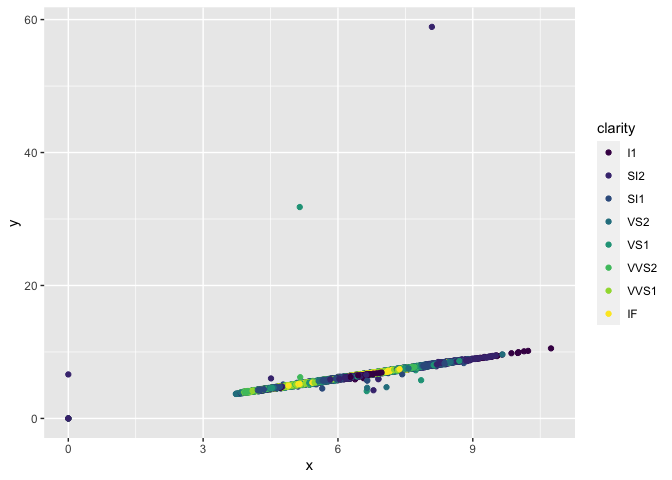
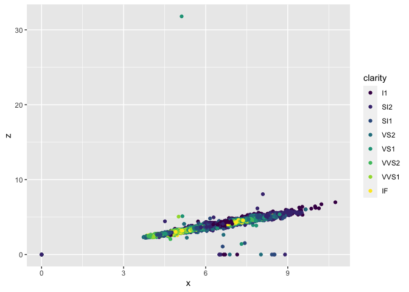
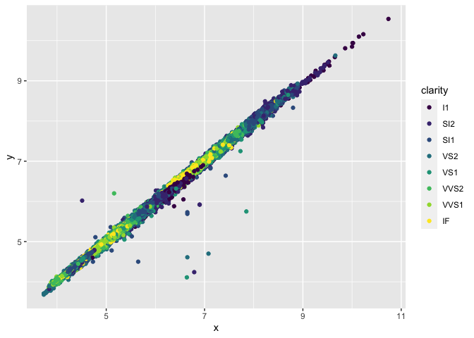
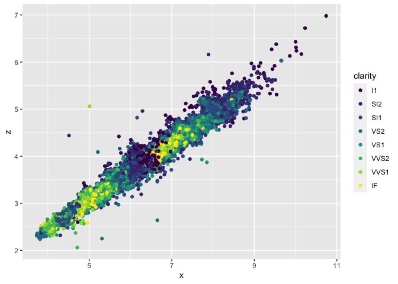

Homework\_5
================

# Part\_1

``` r
library(tidyverse)
data("diamonds")
names(diamonds)
```

    ##  [1] "carat"   "cut"     "color"   "clarity" "depth"   "table"   "price"  
    ##  [8] "x"       "y"       "z"

``` r
diamonds %>% count(cut)
```

    ## # A tibble: 5 × 2
    ##   cut           n
    ##   <ord>     <int>
    ## 1 Fair       1610
    ## 2 Good       4906
    ## 3 Very Good 12082
    ## 4 Premium   13791
    ## 5 Ideal     21551

# Part\_2

``` r
diamonds1 <- sample_n(diamonds, 539, replace = TRUE)
glimpse(diamonds1)
```

    ## Rows: 539
    ## Columns: 10
    ## $ carat   <dbl> 0.31, 2.02, 2.01, 0.35, 0.30, 0.77, 1.03, 0.30, 0.56, 0.53, 0.…
    ## $ cut     <ord> Very Good, Very Good, Premium, Fair, Ideal, Ideal, Premium, Go…
    ## $ color   <ord> D, H, H, E, F, H, F, G, F, G, F, J, D, G, G, G, F, G, E, H, E,…
    ## $ clarity <ord> SI2, SI1, SI1, VVS2, VS2, SI2, SI1, VS1, VS2, VS1, SI1, VS2, S…
    ## $ depth   <dbl> 62.5, 63.4, 62.3, 66.2, 61.3, 60.8, 61.5, 63.3, 60.5, 61.8, 63…
    ## $ table   <dbl> 55, 60, 58, 61, 55, 57, 57, 56, 59, 55, 55, 54, 59, 56, 58, 54…
    ## $ price   <int> 462, 17672, 17235, 738, 605, 2302, 5087, 605, 1935, 1813, 2914…
    ## $ x       <dbl> 4.30, 7.96, 8.04, 4.40, 4.30, 5.96, 6.53, 4.26, 5.42, 5.22, 5.…
    ## $ y       <dbl> 4.34, 8.04, 7.99, 4.36, 4.32, 5.89, 6.44, 4.30, 5.33, 5.17, 5.…
    ## $ z       <dbl> 2.70, 5.07, 4.99, 2.90, 2.64, 3.60, 3.99, 2.71, 3.25, 3.21, 3.…

# Part\_3

``` r
clarity_carat <- diamonds %>%
  group_by(clarity) %>%
  slice_max(carat, n=100) %>%
  summarise(average.size = mean (carat, na.rm = TRUE))
print(clarity_carat)
```

    ## # A tibble: 8 × 2
    ##   clarity average.size
    ##   <ord>          <dbl>
    ## 1 I1              2.46
    ## 2 SI2             2.62
    ## 3 SI1             2.29
    ## 4 VS2             2.22
    ## 5 VS1             2.10
    ## 6 VVS2            1.64
    ## 7 VVS1            1.50
    ## 8 IF              1.39

# Part\_4

``` r
ggplot(data = diamonds) +
   geom_point(mapping = aes(x = x, y = y, color = clarity))
```



``` r
ggplot(data = diamonds) +
   geom_point(mapping = aes(x = x, y = z, color = clarity))
```



# Part\_5

``` r
diamonds2 <- filter(diamonds, x > 3 & z < 10 & y < 20 & z > 2)
ggplot(data = diamonds2) +
   geom_point(mapping = aes(x = x, y = y, color = clarity))
```



``` r
ggplot(data = diamonds2) +
   geom_point(mapping = aes(x = x, y = z, color = clarity))
```


