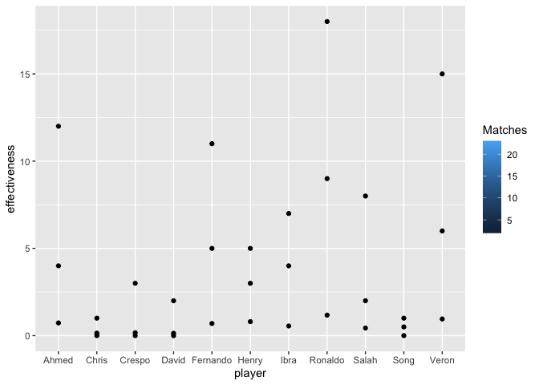
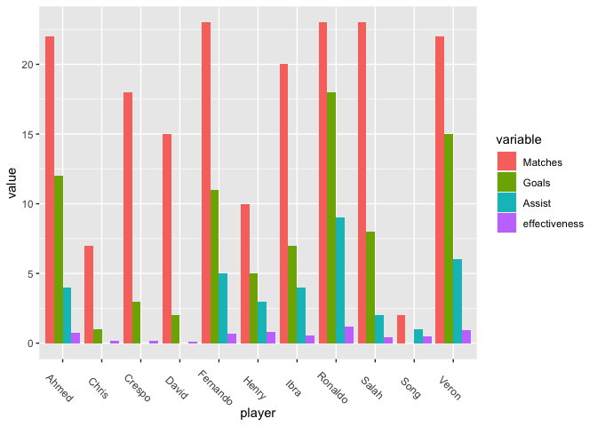

Homework\_7
================

``` r
data = read.csv("/Users/AliAbdulaziz/Desktop/players_records.csv")
library(tidyverse)
library(colorspace)
library(reshape2)
```

# Bad plot

``` r
ggplot(data = data) +
   geom_point(mapping = aes(x = player, y = effectiveness, fill = Matches)) +
  geom_point(mapping = aes(x = player, y = Goals, fill = Matches)) +
  geom_point(mapping = aes(x = player, y = Assist, fill = Matches))
```



The above plot is a bad plot. The plot is intended to represents the listed soccer players and their performance regarding how many goals scored, assist, matches, and overall effectiveness. First of all, the player names are well orgnized. In addition, we can see points in each player coumn, but it is not clear what are the points represents. According to Wilke (6.2 and 10.2), this type of data is best represented by grouped bar plot. The grouped bar plot show more information at once preferably side by side bar plot or seperate plots for each variable.

# Good plot

``` r
d <- melt(data, id.vars="player")
ggplot(d, aes(player,value, fill=variable)) + 
  geom_bar(stat='identity', position='dodge') + 
  theme(axis.text.x = element_text(angle=-45, size=9))
```


