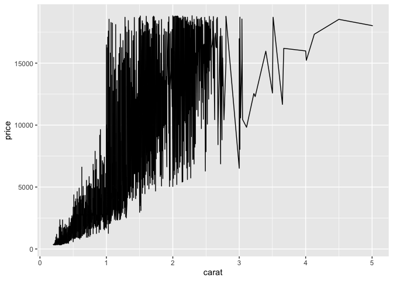
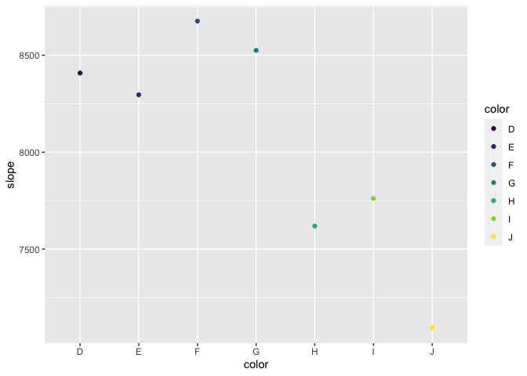

Homework\_8
================

# Question\_1

``` r
library(tidyverse)
library(modelr)
data("diamonds")

ggplot(data = diamonds) +
  geom_point(aes(x = carat, y = price, color = color))
```


``` r
ggplot(data = diamonds) +
  geom_line(aes(x = carat, y = price))
```



``` r
all_by_carat <- lm(formula = carat ~ price + color, data = diamonds)
summary(all_by_carat)
```

    ## 
    ## Call:
    ## lm(formula = carat ~ price + color, data = diamonds)
    ## 
    ## Residuals:
    ##      Min       1Q   Median       3Q      Max 
    ## -1.25582 -0.09821 -0.00943  0.09588  2.49519 
    ## 
    ## Coefficients:
    ##               Estimate Std. Error t value Pr(>|t|)    
    ## (Intercept)  4.068e-01  1.109e-03 366.842  < 2e-16 ***
    ## price        1.066e-04  1.855e-07 574.558  < 2e-16 ***
    ## color.L      2.319e-01  2.488e-03  93.235  < 2e-16 ***
    ## color.Q      9.537e-02  2.337e-03  40.804  < 2e-16 ***
    ## color.C      1.078e-02  2.201e-03   4.899 9.64e-07 ***
    ## color^4     -9.053e-03  2.021e-03  -4.480 7.49e-06 ***
    ## color^5      1.396e-02  1.911e-03   7.304 2.82e-13 ***
    ## color^6      2.394e-02  1.732e-03  13.819  < 2e-16 ***
    ## ---
    ## Signif. codes:  0 '***' 0.001 '**' 0.01 '*' 0.05 '.' 0.1 ' ' 1
    ## 
    ## Residual standard error: 0.1691 on 53932 degrees of freedom
    ## Multiple R-squared:  0.8727, Adjusted R-squared:  0.8727 
    ## F-statistic: 5.282e+04 on 7 and 53932 DF,  p-value: < 2.2e-16

``` r
g_nest <- diamonds %>%
  group_by(color) %>%
  nest()
```

``` r
exp_by_carat <- function(df) {
  m <- lm(price ~ carat, data=df)
  m
}


g_nest <- g_nest %>%
  mutate(fit = map(data, exp_by_carat))

get_slope <- function(fit_obj){
  slope <- coef(fit_obj)[2]
  slope
}

g_nest <- g_nest %>%
  mutate(slope = map_dbl(fit, get_slope))

  
ggplot(g_nest, aes(x=color, y=slope, color = color)) +
  geom_point()
```



# Question\_2

\# Square-root model

``` r
library(nls2)
data("DNase")

fst_mod <- formula(density ~ beta_1 * sqrt(conc) + beta_0)


by_run <- DNase %>% 
  group_by(Run) %>% 
  nest()

run_model <- function(DNase) {
  nls2(fst_mod, 
                    data = DNase, 
                    start = list(beta_1 = 0.5, beta_0 = 0.1))
}


by_run1 <- by_run %>% 
  mutate(model1 = map(data, run_model))


glance <- by_run1 %>% 
  mutate(glance = map(model1, broom::glance)) %>% 
  unnest(glance)

glance %>%
  arrange(AIC) %>%
  head()
```

    ## # A tibble: 6 × 12
    ## # Groups:   Run [6]
    ##   Run   data              model1  sigma isConv  finTol logLik   AIC   BIC deviance
    ##   <ord> <list>            <list>  <dbl> <lgl>    <dbl>  <dbl> <dbl> <dbl>    <dbl>
    ## 1 7     <tibble [16 × 2]> <nls>  0.0748 TRUE   1.53e-7   19.8 -33.7 -31.4   0.0784
    ## 2 1     <tibble [16 × 2]> <nls>  0.0771 TRUE   6.90e-8   19.4 -32.7 -30.4   0.0833
    ## 3 6     <tibble [16 × 2]> <nls>  0.0798 TRUE   7.55e-8   18.8 -31.6 -29.3   0.0891
    ## 4 11    <tibble [16 × 2]> <nls>  0.0799 TRUE   3.88e-8   18.8 -31.6 -29.3   0.0895
    ## 5 4     <tibble [16 × 2]> <nls>  0.0809 TRUE   5.99e-8   18.6 -31.2 -28.9   0.0915
    ## 6 3     <tibble [16 × 2]> <nls>  0.0817 TRUE   1.07e-7   18.4 -30.9 -28.6   0.0935
    ## # … with 2 more variables: df.residual <int>, nobs <int>

``` r
ggplot(glance, aes(x=Run, y=AIC), color = color) + 
  geom_point()
```


\# Monod model

``` r
snd_mod <- formula(density ~ (conc * d_max) / (conc + k))


by_run <- DNase %>% 
  group_by(Run) %>% 
  nest()

run2_model <- function(DNase) {
  nls2(snd_mod, 
                    data = DNase, 
                    start = list(d_max = 0.5, k = 0.1))
}

by_run2 <- by_run %>% 
  mutate(model2 = map(data, run2_model))


glance2 <- by_run2 %>% 
  mutate(glance = map(model2, broom::glance)) %>% 
  unnest(glance)

glance2 %>%
  arrange(AIC) %>%
  head()
```

    ## # A tibble: 6 × 12
    ## # Groups:   Run [6]
    ##   Run   data              model2  sigma isConv  finTol logLik   AIC   BIC deviance
    ##   <ord> <list>            <list>  <dbl> <lgl>    <dbl>  <dbl> <dbl> <dbl>    <dbl>
    ## 1 4     <tibble [16 × 2]> <nls>  0.0138 TRUE   3.20e-6   46.9 -87.9 -85.6  0.00265
    ## 2 5     <tibble [16 × 2]> <nls>  0.0138 TRUE   7.90e-8   46.9 -87.9 -85.6  0.00265
    ## 3 2     <tibble [16 × 2]> <nls>  0.0162 TRUE   8.62e-7   44.3 -82.6 -80.3  0.00369
    ## 4 1     <tibble [16 × 2]> <nls>  0.0197 TRUE   7.58e-7   41.2 -76.4 -74.1  0.00542
    ## 5 9     <tibble [16 × 2]> <nls>  0.0238 TRUE   5.77e-7   38.2 -70.3 -68.0  0.00794
    ## 6 8     <tibble [16 × 2]> <nls>  0.0266 TRUE   8.05e-6   36.4 -66.8 -64.5  0.00988
    ## # … with 2 more variables: df.residual <int>, nobs <int>

``` r
ggplot(glance2, aes(x=Run, y=AIC)) + 
  geom_point()
```


The Monod model has lower AIC value than the Square-root model; therefore, the Monod model is better.

# Extra work

``` r
ggplot(data = DNase) +
  geom_point(aes(x = conc, y = density, color = Run))
```


``` r
DNase %>% 
  ggplot(aes(conc, density)) + 
  geom_line() + 
  ggtitle("Full data = ")
```


\# Square-root model prediction

``` r
by_run_1 <- by_run1 %>% 
  mutate(
    predict = map2(data, model1, add_predictions)
  )

predict <- unnest(by_run_1, predict)

predict %>%
ggplot(aes(density, pred)) +
    geom_line(aes(group = Run), alpha = 1 / 3) + 
    geom_smooth(se = FALSE) + 
  ggtitle("Square root model  ")
```

    ## `geom_smooth()` using method = 'loess' and formula 'y ~ x'


\# Monod model prediction

``` r
by_run_2 <- by_run2 %>% 
  mutate(
    predict2 = map2(data, model2, add_predictions)
  )

predict2 <- unnest(by_run_2, predict2)

predict2 %>%
ggplot(aes(density, pred)) +
    geom_line(aes(group = Run), alpha = 1 / 3) + 
    geom_smooth(se = FALSE) +
  ggtitle("Monod model ")
```

    ## `geom_smooth()` using method = 'loess' and formula 'y ~ x'


